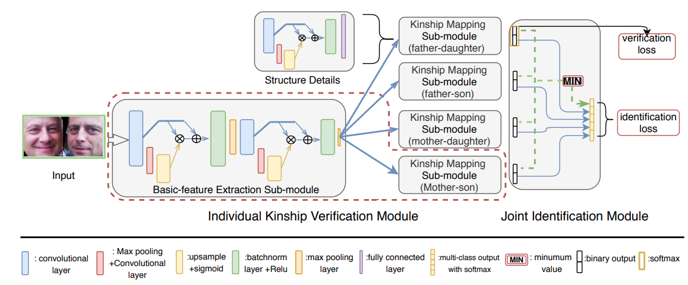

# Kinship Identification through Joint Learning Using Kinship Verification Ensembles

[Wang, W., You, S., & Gevers, T. (2020, August). Kinship Identification through Joint Learning using Kinship Verification Ensembles. In European Conference on Computer Vision (pp. 613-628). Springer, Cham.](https://link.springer.com/chapter/10.1007/978-3-030-58542-6_37)

------------------------
<p align="center" width="100%">
<iframe width="80%"  src="https://www.youtube.com/embed/PZMiyP2oPBo" frameborder="0" allow="accelerometer; autoplay; encrypted-media; gyroscope; picture-in-picture" allowfullscreen></iframe>
</p>
------------------------

## Dataset
The dataset can be downloaded at [KinFaceW Website](https://www.kinfacew.com/download.html)


## Structure

<center>
 
 <figcaption> Architecture of our Joint Learning Network (JLNet)  </figcaption>
</center>

## Train and Test

training:

```
python train.py
```

testing:

```
python test.py
```

## pre-trained model
[link](https://drive.google.com/drive/folders/1CzqX67Z1F0yWJuO4zgpT7s_70P4mVbKE?usp=sharing)
